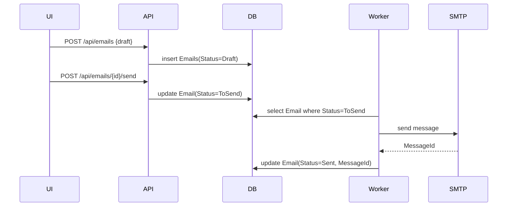

# Email Module Redesign Proposal

## Overview
This document outlines a full rebuild of the email module. The goal is to provide a robust system connecting a React frontend, a .NET API and worker layer, and a relational database (PostgreSQL or MS SQL). The solution persists outgoing and incoming messages, manages attachments, and integrates with the existing **Document** section.

## Architecture
- **Frontend**: React + TypeScript (Next.js) consuming the API via React Query.
- **API**: ASP.NET Core 8 minimal APIs exposing endpoints for email CRUD, attachment management, and document linkage.
- **Worker**: .NET BackgroundService scheduled to send queued emails (SMTP) and receive new mail (IMAP/POP3).
- **Database**: EF Core models with migrations. All messages are stored with full state and a flag `Status=ToSend` for pending items.
- **Storage**: Attachments can be kept in DB (`VARBINARY`) or external blob storage. Each file has a SHA-256 hash and optional preview/thumbnail.
- **Logging & Metrics**: Serilog with correlation IDs, Prometheus/OpenTelemetry metrics, retry counters.
- **Security**: JWT/OAuth auth, attachment size limits, MIME whitelist, antivirus hook, TLS connections.
- **Deployment**: Docker Compose spins up DB, API, worker, and frontend.

## Configuration (appsettings.json)
```jsonc
{
  "SmtpSettings": {
    "Host": "smtp.example.com",
    "Port": 587,
    "EnableSsl": true,
    "Username": "user",
    "Password": "pass",
    "FromEmail": "noreply@example.com",
    "FromName": "Claims System"
  },
  "ImapSettings": {
    "Host": "imap.example.com",
    "Port": 993,
    "Username": "user",
    "Password": "pass"
  },
  "EmailWorker": {
    "PollIntervalSeconds": 60,
    "MaxRetries": 5,
    "AttachmentStorage": "Blob" // Db | Blob | FileSystem
  }
}
```
These settings are bound to strongly typed options classes in the API and worker projects (e.g., `SmtpSettings`, `ImapSettings`, `EmailWorkerOptions`).

## Data Model
Tables (simplified):
- **Emails** `(Id GUID PK, Direction enum, From, To, Cc, Bcc, Subject, BodyHtml, BodyText, Status enum, SendAfterUtc, RetryCount, LastError, CreatedUtc, UpdatedUtc, MessageId, ThreadId)`
- **EmailAttachments** `(Id PK, EmailId FK, FileName, MimeType, SizeBytes, StorageLocation enum, StorageKey, HashSha256, PreviewAvailable, CreatedUtc)`
- **Documents** `(Id PK, Title, CategoryId FK, StorageKey, MimeType, CreatedUtc, OwnerId)`
- **DocumentCategories** `(Id PK, Name, ParentId)`
- **EmailAttachmentToDocumentLinks** `(Id PK, EmailAttachmentId FK, DocumentId FK, CategoryId FK, CreatedUtc)`
- **EmailQueue** `(EmailId FK, ScheduledUtc, Attempts, NextAttemptUtc, Priority)`
- **AuditLogs** `(Id, EntityType, EntityId, Action, UserId, TimestampUtc, Details JSONB)`
Indices are added on `Emails(Status, Direction, CreatedUtc, MessageId)` and `EmailQueue(NextAttemptUtc, Priority)`.

### SQL Schema (excerpt)
```sql
CREATE TABLE Emails (
    Id              UUID PRIMARY KEY,
    Direction       SMALLINT NOT NULL,
    "From"          TEXT NOT NULL,
    "To"            TEXT[] NOT NULL,
    Cc              TEXT[] NULL,
    Bcc             TEXT[] NULL,
    Subject         TEXT NOT NULL,
    BodyHtml        TEXT NULL,
    BodyText        TEXT NULL,
    Status          SMALLINT NOT NULL,
    SendAfterUtc    TIMESTAMPTZ NULL,
    RetryCount      INT NOT NULL DEFAULT 0,
    LastError       TEXT NULL,
    CreatedUtc      TIMESTAMPTZ NOT NULL DEFAULT NOW(),
    UpdatedUtc      TIMESTAMPTZ NOT NULL DEFAULT NOW(),
    MessageId       TEXT NULL,
    ThreadId        UUID NULL
);

CREATE TABLE EmailAttachments (
    Id              UUID PRIMARY KEY,
    EmailId         UUID NOT NULL REFERENCES Emails(Id),
    FileName        TEXT NOT NULL,
    MimeType        TEXT NOT NULL,
    SizeBytes       BIGINT NOT NULL,
    StorageLocation SMALLINT NOT NULL,
    StorageKey      TEXT NOT NULL,
    HashSha256      CHAR(64) NOT NULL,
    PreviewAvailable BOOLEAN NOT NULL DEFAULT FALSE,
    CreatedUtc      TIMESTAMPTZ NOT NULL DEFAULT NOW()
);

CREATE TABLE EmailQueue (
    EmailId         UUID PRIMARY KEY REFERENCES Emails(Id),
    ScheduledUtc    TIMESTAMPTZ NOT NULL,
    Attempts        INT NOT NULL DEFAULT 0,
    NextAttemptUtc  TIMESTAMPTZ NOT NULL,
    Priority        SMALLINT NOT NULL DEFAULT 0
);

CREATE INDEX IX_Emails_Status_Direction_CreatedUtc ON Emails (Status, Direction, CreatedUtc);
CREATE INDEX IX_EmailQueue_NextAttempt_Priority ON EmailQueue (NextAttemptUtc, Priority);
```

## API Endpoints
OpenAPI generated under `/swagger`.
- `POST /api/emails` – create draft or send-ready email.
- `GET /api/emails` – list with filters (`direction`, `status`, `dateFrom`, `dateTo`, `search`).
- `GET /api/emails/{id}` – details with attachments and document links.
- `POST /api/emails/{id}/attachments` – upload or link existing Document by `documentId` + `categoryId`.
- `GET /api/emails/{id}/attachments/{attId}/preview` – stream preview.
- `GET /api/emails/{id}/attachments/{attId}/download` – download stream.
- `POST /api/emails/{id}/send` – change `Status` to `ToSend`.
- `POST /api/emails/inbound/sync` – trigger worker to fetch inbound mail (testing).
- `GET /api/documents` & `GET /api/document-categories` – support pickers in UI.

### Example Request/Response
**Create draft with attachment reference**
```http
POST /api/emails HTTP/1.1
Content-Type: application/json

{
  "to": ["user@example.com"],
  "subject": "Invoice",
  "bodyHtml": "<p>See attached.</p>",
  "attachmentRefs": [
    { "documentId": "8b6c7b5e-1e0f-4fa2-9fb7-0a8e9f1f3c9f", "categoryId": "invoices" }
  ]
}
```

**Response**
```json
{
  "id": "0f7b4c91-5ec4-4ecf-9d03-9ec24579c412",
  "status": "Draft",
  "createdUtc": "2024-01-01T12:00:00Z"
}
```

## Worker Logic
**Sending**
1. Select due items from `EmailQueue` (or fallback to `Emails` where `Status=ToSend`).
2. Lock row, send via SMTP.
3. Update `MessageId`, set `Status=Sent` or `Failed`; update `EmailQueue` with next attempt and increment `RetryCount` using exponential backoff.

**Receiving**
1. Poll IMAP/POP3 for new messages.
2. Deduplicate by `MessageId`.
3. Persist as `Direction=Inbound, Status=Received` and store attachments.
4. Apply rules to auto-link attachments to `DocumentCategories`; allow manual reclassification in UI.

### Pseudocode
```csharp
while (true)
{
    var due = db.EmailQueue
        .Where(q => q.NextAttemptUtc <= now)
        .OrderBy(q => q.Priority)
        .Take(batchSize)
        .ToList();

    foreach (var item in due)
    {
        using var tx = db.BeginTransaction();
        var email = db.Emails.Find(item.EmailId, lock: true);
        try
        {
            smtp.Send(email);
            email.Status = Sent;
            queue.Remove(item);
        }
        catch (Exception ex)
        {
            email.RetryCount++;
            item.NextAttemptUtc = now + Backoff(email.RetryCount);
            email.LastError = ex.Message;
        }
        tx.Commit();
    }

    await Task.Delay(pollInterval);
}
```

## Frontend Features
- **Mailbox Views**: Inbox, Sent, Drafts, Queue, Errors.
- **Composer**: HTML editor, To/Cc/Bcc fields, `SendAfterUtc`, drag&drop uploads, “Add from Documents” picker, validation.
- **Message Detail**: Shows body, attachments with Preview/Download, actions (`Send`, `Change Document Category`, `Archive`).
- **Attachment Preview**: PDF/images/text inline; others via download.
- **State Management**: React Query or Zustand, with loading/error states.
- **Accessibility & i18n**: ARIA labels, PL/EN translations.

## Attachment Handling
- Previews generated for PDF, images, text; plugin interface for additional formats.
- Size & count limits validated on both client and server.
- SHA-256 hash for deduplication; AV scan hook before persistence.
- Streamed downloads with `Content-Disposition` headers.

### Environment & Configuration
- `SMTP_HOST`, `SMTP_PORT`, `SMTP_USER`, `SMTP_PASSWORD`
- `IMAP_HOST`, `IMAP_PORT`, `IMAP_USER`, `IMAP_PASSWORD`
- `STORAGE_PROVIDER` (`db`, `blob`, `filesystem`)
- `MAX_ATTACHMENT_MB` and `ALLOWED_MIME`
- `JWT_AUTHORITY`, `JWT_AUDIENCE`
- `OTEL_EXPORTER_OTLP_ENDPOINT`

Example `.env` fragment:
```env
SMTP_HOST=smtp.example.com
SMTP_PORT=587
SMTP_USER=mailer
SMTP_PASSWORD=secret
STORAGE_PROVIDER=db
```

## Non‑Functional Requirements
- **Performance**: Batched SMTP/IMAP operations, async I/O, database indexes.
- **Scalability**: Horizontal worker instances with advisory locks; idempotent operations.
- **Quality**: Unit/integration tests, OpenAPI contract tests, Playwright e2e.
- **Observability**: Metrics for sent/received counts, processing times, errors; logs with correlation IDs.
- **Documentation**: ADRs, README, architecture and sequence diagrams.

## Security Considerations
- Rate limiting on API endpoints to mitigate abuse.
- All secrets stored in environment variables or secret manager.
- Attachments scanned with AV engine before persistence.
- Encrypt attachment blobs at rest when using DB or filesystem providers.

## Sample Sequence


## Docker Compose (excerpt)
```yaml
services:
  db:
    image: postgres:16
  api:
    build: ./backend
  worker:
    build: ./worker
    depends_on: [db]
  frontend:
    build: ./
    depends_on: [api]
```

## Definition of Done
1. Repo contains projects for frontend, API, worker, and infra.
2. `docker-compose up` launches DB, API, worker, and frontend.
3. OpenAPI available at `/swagger`; Postman collection provided.
4. Scenario: create email with attachments, flag `ToSend`, worker sends and marks `Sent`.
5. Scenario: worker retrieves inbound mail, user links attachments to Document categories with preview/download in UI.
6. Tests pass in CI; metrics dashboard functional.

